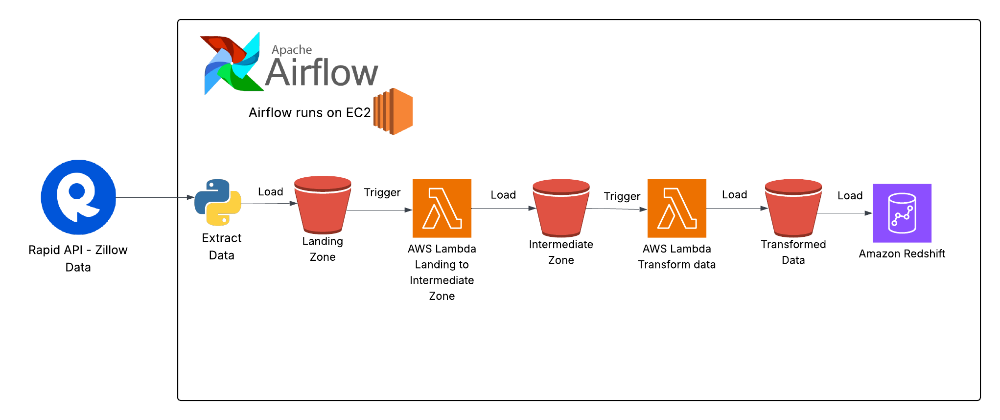

# Data Pipeline Architecture with Airflow and AWS Cloud



This repository provides the code and instructions to build a robust, production-grade data pipeline using **Apache Airflow** and various **AWS Cloud** services. The architecture is designed for extracting, transforming, and visualizing data, as depicted in the diagram above.

---

## Architecture Overview

The pipeline consists of the following stages:

1. **Extract Data from Zillow RapidAPI**
   - Use a Python script to fetch data from the Zillow RapidAPI.
   - Orchestrated by Apache Airflow running on an EC2 instance.

2. **Landing Zone (S3 Bucket)**
   - Raw data is loaded into an AWS S3 bucket (Landing Zone).

3. **Lambda Function (Trigger 1)**
   - Triggered by new objects in the Landing Zone bucket.
   - Performs validation or basic processing, then copies/loads data into the Intermediate Zone bucket.

4. **Intermediate Zone (S3 Bucket)**
   - Stores validated/intermediate data.

5. **Lambda Function (Trigger 2)**
   - Triggered by new objects in the Intermediate Zone bucket.
   - Performs transformations and loads the processed data into the Transformed Data bucket.

6. **Transformed Data (S3 Bucket)**
   - Holds fully processed, transformed data ready for analytics.

7. **Load to Redshift**
   - Data is loaded from the Transformed Data bucket into AWS Redshift for analysis.

8. **Visualization (QuickSight)**
   - Amazon QuickSight connects to Redshift to visualize and analyze the data.

---

## Components Used

- **Apache Airflow** (on EC2): Orchestrates the entire workflow.
- **AWS S3**: Three buckets (Landing Zone, Intermediate Zone, Transformed Data).
- **AWS Lambda**: Automated event-driven processing.
- **AWS Redshift**: Data warehousing.
- **Amazon QuickSight**: Data visualization.
- **Zillow RapidAPI**: Data source.

---

## Step-by-Step Setup Guide

### 1. Prerequisites

- AWS account with necessary permissions for S3, Lambda, EC2, Redshift, and QuickSight.
- IAM roles for Lambda and EC2 with access to S3 and Redshift.
- Python 3.x, AWS CLI, and Boto3 installed.
- RapidAPI account and Zillow API key.

### 2. Launch an EC2 Instance and Install Airflow

- Launch an EC2 instance (Amazon Linux 2 recommended).
- Install Airflow:
  ```bash
  pip install apache-airflow
  ```
- Initialize Airflow and start the webserver/scheduler.

### 3. Set Up S3 Buckets

- Create three S3 buckets:
  - `your-landing-zone-bucket`
  - `your-intermediate-zone-bucket`
  - `your-transformed-data-bucket`

### 4. Create Lambda Functions

- **Lambda 1**: Triggered by new files in the Landing Zone bucket. Validates and moves/copies data to the Intermediate Zone.
- **Lambda 2**: Triggered by new files in the Intermediate Zone bucket. Transforms data and moves it to the Transformed Data bucket.
- Use Python or Node.js for Lambda code.
- Assign IAM roles with S3 access.

### 5. Airflow DAG

- Write a DAG that:
  - Calls the Zillow RapidAPI and downloads data.
  - Uploads raw data to the Landing Zone bucket.
  - Optionally, can monitor the pipeline or trigger Lambda functions via AWS SDK.

### 6. Load Data into Redshift

- Create a Redshift cluster.
- Set up tables/schema.
- Use Airflow or Lambda to copy data from the Transformed Data bucket to Redshift using the `COPY` command.

### 7. Visualize with QuickSight

- Set up Amazon QuickSight.
- Connect QuickSight to Redshift.
- Create dashboards and reports as needed.

---

## Example Airflow DAG (Simplified)

```python
from airflow import DAG
from airflow.operators.python_operator import PythonOperator
from datetime import datetime

def extract_zillow_data():
    # Your code to call Zillow API and save data locally
    pass

def upload_to_s3():
    # Your code to upload extracted data to the S3 Landing Zone
    pass

default_args = {
    'owner': 'airflow',
    'start_date': datetime(2024, 1, 1),
}

with DAG('zillow_data_pipeline', default_args=default_args, schedule_interval='@daily') as dag:
    extract = PythonOperator(
        task_id='extract_data',
        python_callable=extract_zillow_data
    )
    upload = PythonOperator(
        task_id='upload_to_s3',
        python_callable=upload_to_s3
    )

    extract >> upload
```

---

## Security & Best Practices

- Secure all AWS resources with IAM roles and policies.
- Do not hard-code credentials; use environment variables or AWS Secrets Manager.
- Enable logging for Lambda, Airflow, and S3 for auditing.
- Use S3 bucket versioning and lifecycle policies for data retention.

---

## Troubleshooting

- Check AWS CloudWatch logs for Lambda errors.
- Use Airflow logs for debugging DAG runs.
- Ensure all IAM permissions are correctly set.

---

## References

- [Apache Airflow Documentation](https://airflow.apache.org/docs/)
- [AWS Lambda Documentation](https://docs.aws.amazon.com/lambda/latest/dg/welcome.html)
- [Amazon Redshift Documentation](https://docs.aws.amazon.com/redshift/)
- [Amazon QuickSight Documentation](https://docs.aws.amazon.com/quicksight/)
- [RapidAPI Zillow Documentation](https://rapidapi.com/apidojo/api/zillow-com1/)

---

## Diagram

See above: 

---

## License

MIT License

---
